# Krita Linework Tools

Editable linework **inside Krita**, inspired by **Paint Tool SAI** linework layers, with automatic raster conversion using a port of the **same OpenToonz Centerline algorithm**.

Draw directly on the canvas with Krita brush presets, then edit the centerline, Bézier handles, thickness and brush. Six native tools live in Krita's toolbox; their controls appear in **Tool Options**, and Linework layers appear in **Layers** with a dedicated icon.

Developed with **OpenAI Codex**. **Ghidra 11.0.3 was used for static reverse engineering of Paint Tool SAI 2** to investigate its linework features and guide the reproduction of their behavior. The [implementation and scope](#codex-ghidra-and-reverse-engineering) are documented below.

> **Version 0.1.3 · experimental desktop build for Krita 5.2.14.** The native bridge uses Krita's internal ABI. Each platform package needs the matching application and compatible libraries; other Krita builds require recompilation and validation. Android remains outside the current release.

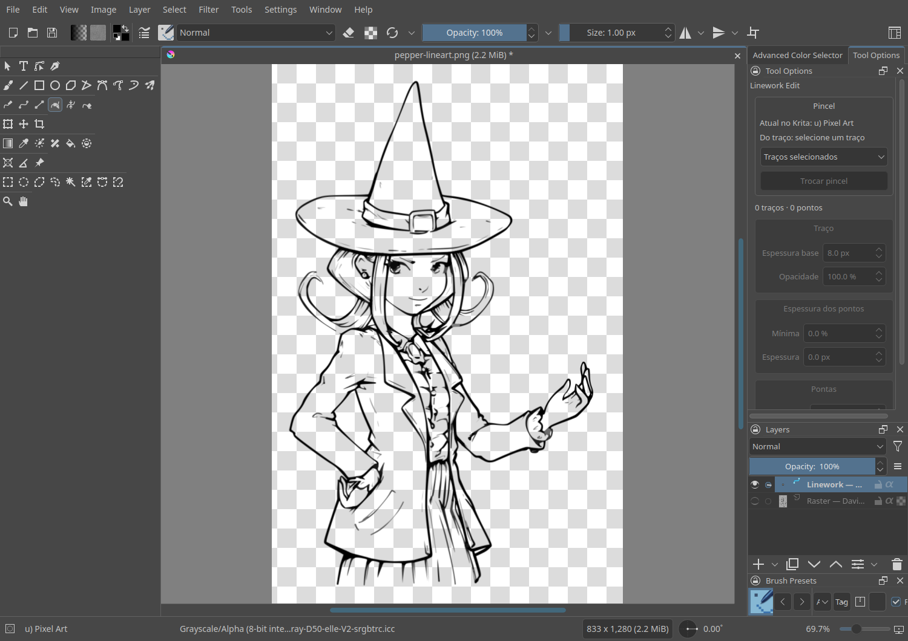

*Real Krita screenshot: an editable Linework layer, native tools and the preserved raster source. Artwork: David Revoy, “Characters lineart”, Pepper&Carrot, [CC BY 4.0](https://creativecommons.org/licenses/by/4.0/); cropped, resized, converted to grayscale and adjusted with levels. [Source and modifications](docs/ARTWORK.md). The screenshots show the plugin's Portuguese controls; this article and the installation documentation are in English.*

## Download and install

Download a platform package from [version 0.1.3](https://github.com/ad3rek/krita-linework-tools/releases/tag/v0.1.3). Save your work and close Krita before installing.

Version **0.1.3** packages the refined Tool Options interface and performance improvements for point picking, erasing, native preset parsing and history. It includes all 0.1.2 features and fixes: two eraser modes, point merging and endpoint joining, larger click targets, point/stroke selection, active-point locking, color editing and ordered input replay to prevent strokes disappearing on release. [Changelog](CHANGELOG.md).

The [development source from `main`](https://github.com/ad3rek/krita-linework-tools/archive/refs/heads/main.zip) can also be installed with the steps below. Version 0.1.3 includes the interface and performance changes described in [performance and Tool Options](#performance-and-tool-options). The previous 0.1.2 archives remain available unchanged.

| Package | Required application | Validation environment |
| --- | --- | --- |
| [Linux x86_64](https://github.com/ad3rek/krita-linework-tools/releases/download/v0.1.3/Krita-Linework-Tools-0.1.3-linux-x86_64.zip) | Krita 5.2.14, compatible Qt 5.15.17 libraries | KDE Neon, Python 3.12 |
| [Windows x86_64](https://github.com/ad3rek/krita-linework-tools/releases/download/v0.1.3/Krita-Linework-Tools-0.1.3-windows-x86_64.zip) | Official Krita 5.2.14 x64, Qt 5.15.7 | Experimental preview; canvas regressions tested under Wine 11.0 |

On Linux, extract the archive, open a terminal in its folder and run:

```sh
python3 install.py --enable
```

On Windows, use the **Windows x86_64** archive with the official Krita 5.2.14 x64 build:

1. Extract the archive and open Krita's resource folder through **Settings → Manage Resources → Open Resource Folder**, then close Krita.
2. Copy `linework/`, `linework.desktop` and `linework.action` from the extracted package into the resource folder's `pykrita/` directory. Back up an existing Linework installation first.
3. Reopen Krita, enable **Krita Linework Tools** in **Settings → Configure Krita → Python Plugin Manager**, and restart once more.

The usual resource directory is `%APPDATA%\krita`, but the folder shown by Krita is authoritative. If Python 3 is installed separately, `py -3 install.py --enable` is an alternative with automatic backups. Windows configuration is read from `%LOCALAPPDATA%\kritarc`; a custom `ResourceDirectory` is honored. No compiler or Ghidra installation is needed to use a release package.

Restart Krita and select **Linework Brush**. The installer preserves the previous plugin and any changed configuration in `linework-backups` inside Krita's resource folder. `--resources /path/to/resources` selects a custom resource folder. Manual activation is available in **Settings → Configure Krita → Python Plugin Manager**. See the [manual](linework/Manual.html), [technical reference](docs/REFERENCE.txt) and [native build instructions](linework/native/BUILD.txt).

## Drawing and editing in Krita

Choose **Linework Brush**, pick a preset in Krita's brush panel and draw on the canvas. The current preset, color, size, opacity and flow are captured when a stroke starts. Switching presets affects new strokes; an existing stroke keeps its own preset until you explicitly replace it.

| Tool | What it does |
| --- | --- |
| Linework Brush | Draw with Krita's native paint engines and smoothing. |
| Linework Curve / Line | Place points by clicking; Enter or right click finishes. |
| Linework Edit | Move points or groups, edit handles, insert points and delete the selection. |
| Linework Thickness | Edit the nominal diameter in pixels, with guides and multiple point selection. |
| Linework Erase | Remove whole strokes or reduce thickness at existing points. |

The toolbox icons follow Krita's theme and the group has a separator. Controls use the native Tool Options docker. The first stroke creates a Linework layer when the active layer is not already Linework; **Tools → Scripts → New Linework Layer** starts another one.

Krita presets produce raster textures. The editable geometry and the rendered appearance are both embedded in the vector layer and saved in `.kra`. The saved appearance remains visible without the plugin; rerendering requires the original preset and its resources.

In **Linework Edit** or **Linework Thickness**, changing Krita's foreground color recolors the selected strokes, including native brush textures and smooth lines. Color picker changes are collected before rendering and committed as one undo step. Selecting a stroke alone keeps its saved color. **Tool Options → Brush → Apply current color** applies the foreground to **Selected strokes** or **All strokes in the layer**, using the scope above the button. Geometry, pressure, thickness and brush settings are preserved. Presets that use their own multicolor tip or color dynamics can still produce colors beyond the foreground, as in native Krita painting.

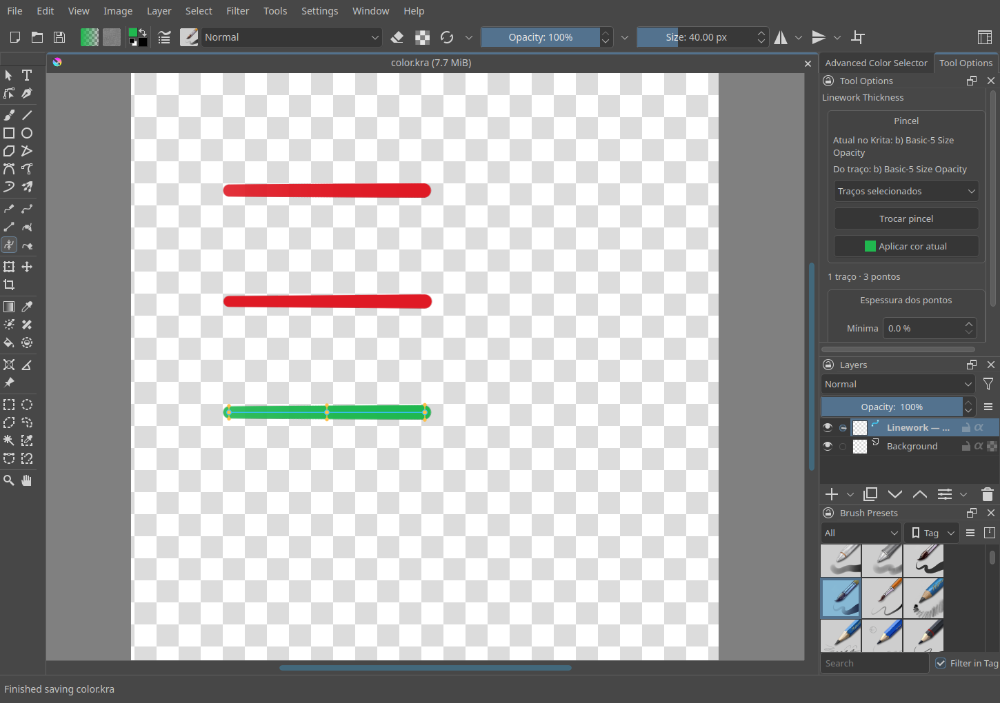

*Synthetic native brush and smooth line test: foreground recoloring, selected/whole-layer scope, grouped undo/redo, rendered pixels, locked layers and `.kra` round trips passed in Krita 5.2.14 on Linux. [Color regression report](docs/validation/color.json).*

## Convert a lineart into editable strokes

The demonstration uses **Pepper**, drawn by **David Revoy** for **Pepper&Carrot**, under **CC BY 4.0**. The fixture is a crop of the original, resized to **833 × 1280**, converted to **8-bit grayscale**, then treated with input levels **128–220**, gamma **1.0**, output **0–255**. This darkens the lines and clears the light shading while retaining edge gradation. The distributed PNG already contains this treatment. [Exact preparation and hashes](docs/validation/artwork-source.json).

Select the active bitmap layer and open **Tools → Scripts → Vectorize Layer to Linework**. Adjust the threshold, despeckling, accuracy and maximum width, then inspect the zoomable preview. Confirming creates a new Linework layer; the source remains intact and can be hidden.

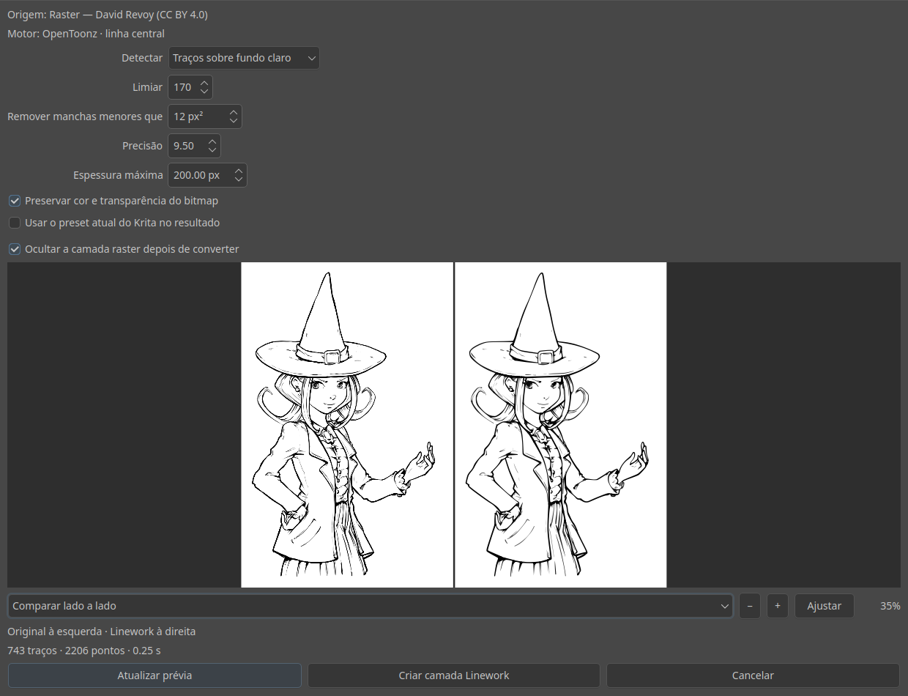

*Source on the left, centerline result on the right. David Revoy's artwork, CC BY 4.0, with the preparation described above.*

With threshold **170**, despeckling below **12 px²**, accuracy **9.5** and maximum width **200 px**, the test produced **743 strokes and 2,206 anchors**. The preview reported **0.25 s** for extraction and preparation, excluding final layer creation and native brush rendering. The source pixels remained unchanged after conversion, editing and saving.

The vectorizer extracts centerlines and radii. It does not reconstruct filled regions or gradients. Threshold and image resolution affect the details and small segments detected; sketchy lineart may need cleanup after conversion.

## Points, thickness and changing brushes

In **Linework Edit**, drag a point or a selected group. **Tool Options → Selection** offers automatic point/stroke picking, **Points** or **Strokes**. Stroke mode selects the whole path even when you click an anchor; dragging moves all its points. **Lock active point** keeps one anchor selected while you edit it or its handles, and ignores clicks elsewhere until you unlock it. These options also apply to Thickness. The click radius defaults to **16 screen pixels**, is adjustable from 4–40 px and stays constant while zooming; the closest point or handle wins. The active point shows square handles; Alt-drag moves one handle without aligning the opposite one. Double click a stroke or Alt-click to insert a point through subdivision without changing the curve. Delete removes the selection.

Shift-click adds or removes items, dragging on empty canvas makes a point selection rectangle, and Ctrl+A selects all. A selection made with Krita's native **Select Shapes** is inherited by Edit and Thickness. This lets you adjust points across several strokes together.

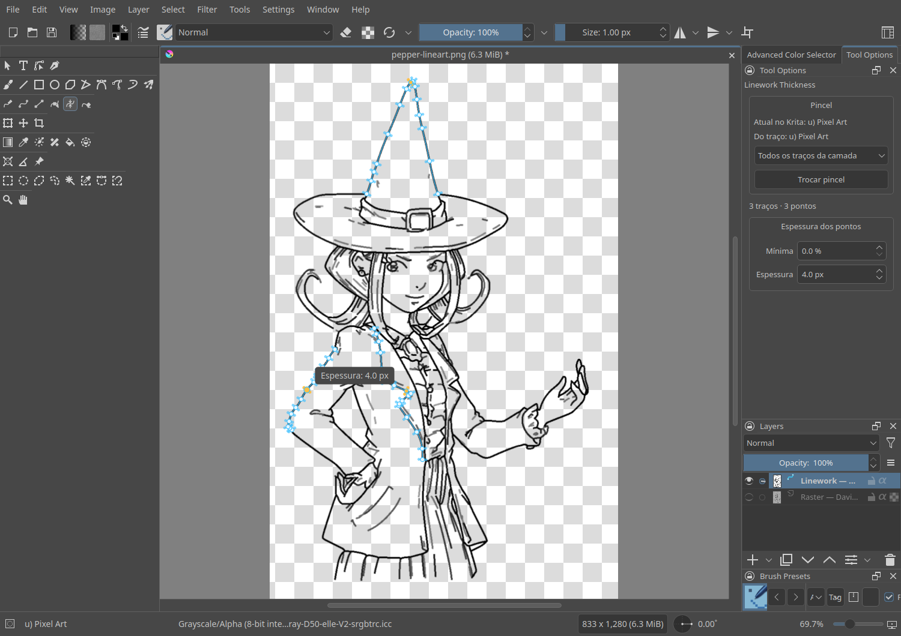

*All 743 strokes were changed to the native `u) Pixel Art` preset and all diameters set to 4 px. Three selected points show width guides and a canvas indicator. David Revoy's artwork, CC BY 4.0, adapted with Linework.*

Thickness means the **nominal brush diameter in pixels**. Recorded stylus pressure remains independent and available to opacity and other sensors. The first width edit of a native stroke converts its pressure-to-size contribution using Krita's own curve. Direct diameter control supports smooth lines and Pixel/Color Smudge presets; tip shape and texture can make the painted area differ from the nominal diameter.

To replace brushes on existing vectors, choose a preset in Krita, select **Selected strokes** or **All strokes in the layer**, and click **Change brush** in Tool Options. Preparation is incremental, with progress and cancellation; the whole operation is one Linework undo step. The installed preset is not modified.

During point, handle or thickness dragging, affected strokes' original appearances are hidden from rendering and held in cache. The preview takes their place. Esc restores the confirmed data and appearance; release rerenders and commits the change.

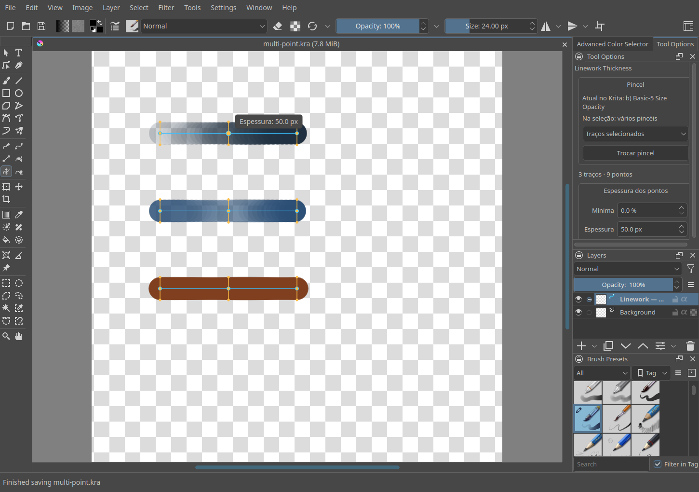

*Synthetic test curves: selection across strokes, independent diameters and controls in native Tool Options.*

Moving, scaling, rotating or mirroring with native shape tools updates the points and handles and rerenders the preset. Uniform scaling scales thickness; nonuniform scaling uses the geometric mean of the two scale factors. Resizing the whole document does not currently update the stored centerline metadata.

## Erasing, merging and joining

**Linework Erase → Mode** offers **Erase line** (`Apagar linha`) and **Erase points** (`Apagar pontos`). Line mode removes every stroke crossed by the circular cursor, including fast movements. Point mode reduces the diameter of existing anchors inside the circle; it retains their position, handles and recorded stylus pressure. Size follows Krita's brush size, while strength and tablet pressure control thinning. Repeated stationary samples do not accumulate within the same gesture; another gesture can thin further. A point can reach zero thickness and remain editable. The cursor highlights anchors in range. Each gesture is one undo step; Esc restores the original appearance.

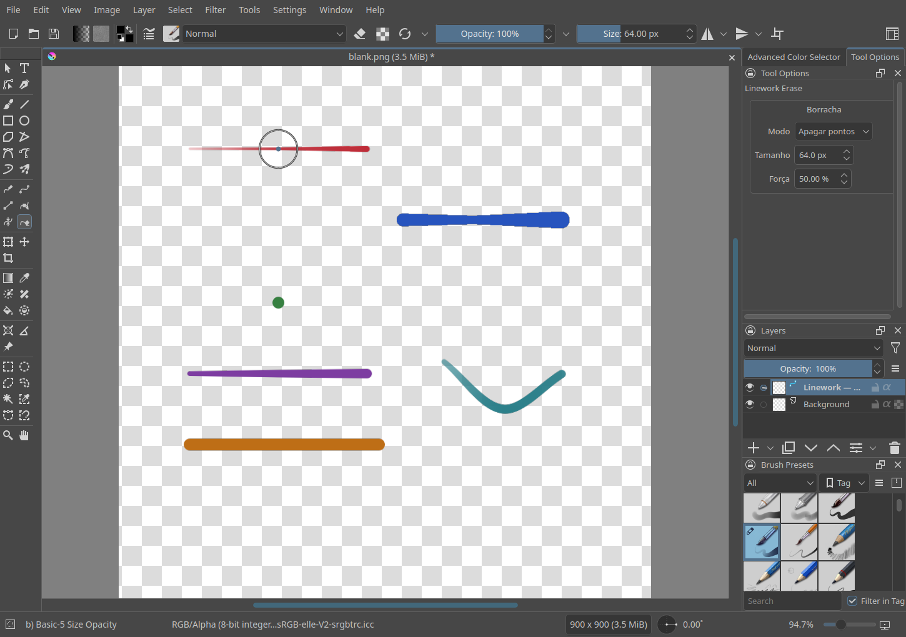

*Synthetic native brush test, showing the eraser footprint and an affected anchor. Confirmed strokes are hidden and cached during editing, so the preview does not duplicate them. Saving during an eraser gesture finishes it once.*

In **Linework Edit → Points and connections**, Shift-click the anchors you want to use. **Merge points** (`Mesclar pontos`) collapses two or more consecutive points on one path, or welds one endpoint from each of two paths. Choose **At center** or **At active point**; the merged point takes the average position/diameter or the active point's values. **Join endpoints** (`Unir pontas`) keeps both anchors and connects them with a segment. Selecting both endpoints of the same path closes it.

The last selected point is active. When joining different paths, the result uses the **active stroke's brush, color and other appearance settings**, while preserving the original points' independent diameters and recorded pressure. Exterior handles are retained; internal endpoint tapers cease to be tips. These operations support linear paths; arbitrary branching networks and nonconsecutive point merges are not supported. Preparation can be canceled and each completed operation is one undo step.

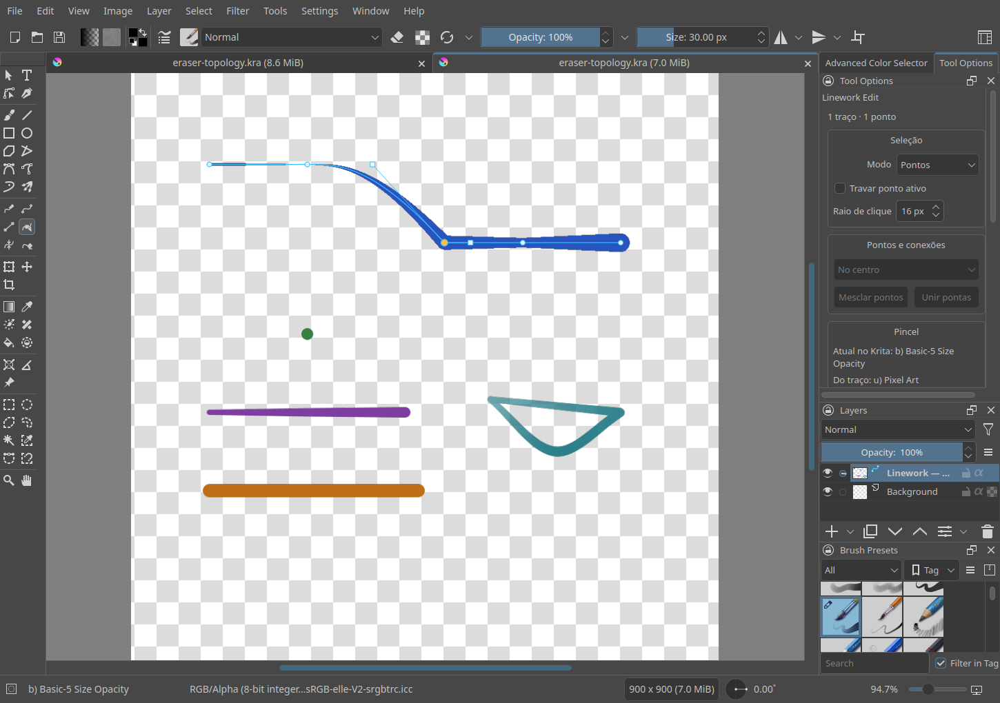

*Real Krita screenshot with synthetic paths: joined and welded native strokes, a merged path, and a closed curve. [Linux regression](docs/validation/eraser-topology.json) · [Windows/Wine regression](docs/validation/windows-eraser-topology.json).*

## Native smoothing with fewer points

Linework Brush uses Krita's **KisToolFreehandHelper** and **KisSmoothingOptions**: None, Basic, Weighted and Stabilizer. Distance, finishing, pressure smoothing and delay appear in Tool Options and share Krita's smoothing configuration.

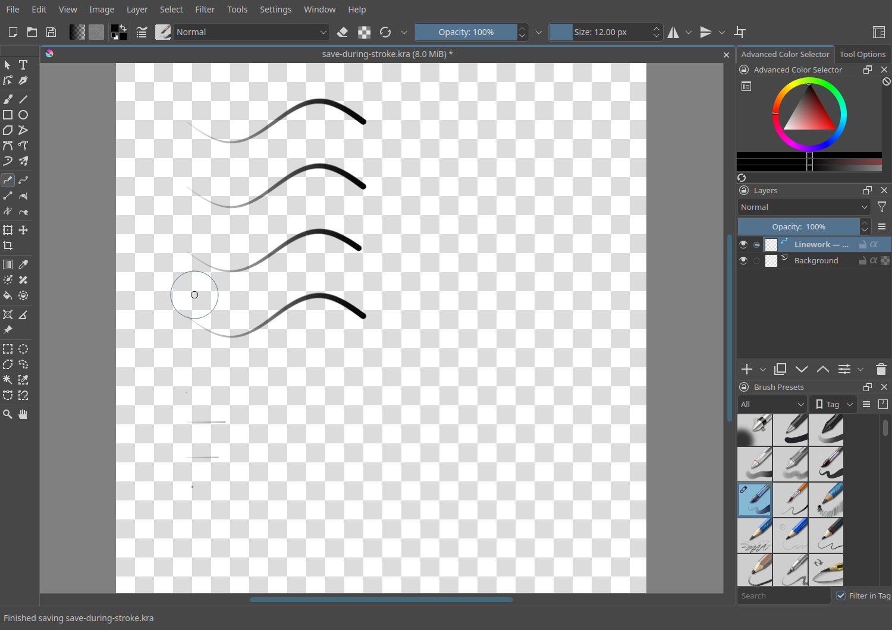

After a new Brush stroke finishes, its centerline is compacted into fewer Bézier anchors. This happens after native smoothing and preserves corners and pressure/thickness variation within the configured tolerances. Existing strokes, click-created curves and imported OpenToonz output are not automatically compacted.

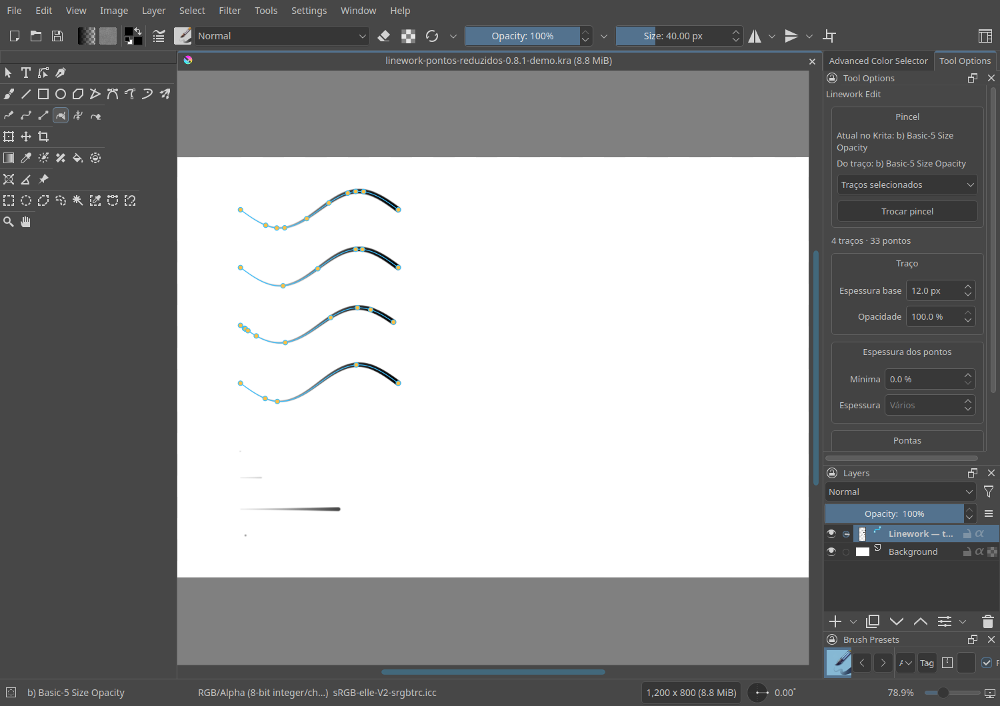

*Saved development reduction example, reopened in the editor.*

A fresh automated canvas run with Qt tablet events and 100 moves per stroke produced:

| Smoothing | Anchors before → after | Maximum sampled position error | Compaction time |
| --- | --- | --- | --- |
| None | 101 → 11 | 0.120 px | 22.1 ms |
| Basic | 101 → 5 | 0.121 px | 75.9 ms |
| Weighted | 101 → 12 | 0.196 px | 54.1 ms |
| Stabilizer | 1,233 → 6 | 0.278 px | 167.7 ms |

These values describe one drawing and run. Stabilizer timing changes its sample count; different curves need different numbers of anchors. The earlier saved `smoothing-and-points.kra` example produced 10/6/12/5 anchors. Both reports are included. Automated tests used Qt tablet events rather than a physical stylus.

## Performance and Tool Options

The following changes are included in **0.1.3**. The editor uses a conservative spatial grid for anchor picking, rectangle selection and swept erasing. Exact distance, outline and diameter calculations still decide the result. Only changed paths are reindexed after an edit; large paths and very large selections use bounded fallbacks.

The native renderer retains up to eight private parsed preset prototypes (at most 8 MiB of XML). Every paint operation clones private settings before applying its own size, opacity, flow and diameter sensors. Cache keys include the source preset, XML, resource version and checksum. Closing the renderer releases the prototypes; older bridges use the original entry points. History shares unchanged stroke snapshots between steps, while undo/redo return independent editable copies.

Measurements and regression scope are recorded in [the development performance report](docs/validation/performance.json). Point/eraser query timings measure hot searches on the 743-stroke, 2,206-anchor CC fixture, not an entire eraser gesture or a document write. Initial indexing has a separate cost. Native preview timing uses paired cached/uncached Pixel Art renders in one process; unchanged pixels are checked across style and independent-diameter changes. History timing changes one anchor per step; memory figures cover Python allocations, excluding Qt/native images. These local measurements are not performance guarantees for other presets or documents.

The development checkout passed **83 CPU tests**, **11 real-application GUI regressions** and paired Linux/Windows-Wine performance probes. The Linux full 743-stroke conversion, brush/thickness edits and save/reopen check completed with a normal application exit. Windows remains an experimental preview: Wine tests do not establish physical Windows or tablet compatibility, and the earlier full-layer Windows bulk replay/history check remains incomplete.

| Linux measurement | Reference (ms) | Optimized (ms) |
| --- | ---: | ---: |
| Point pick: linear search → indexed search | 2.749 | 0.042 |
| Point eraser weights: all anchors → nearby anchors | 2.676 | 0.032 |
| Native Pixel Art preview: uncached → cached preset | 79.92 | 78.30 |
| History commit: previous source → shared snapshots | 173.45 | 31.19 |

The initial index took 38.54 ms; updating one moved point and picking again averaged 0.60 ms. Point and eraser comparisons use equivalent linear searches in the same process and require identical results. The history benchmark uses 20 edits and three timing repetitions; its separate Python allocation peak fell from 25.35 to 4.65 MiB. Windows/Wine results are included separately in the report.

The development Tool Options layout places selection and point thickness first when editing. Sections can be collapsed without changing their values; brush/color actions share one row, and less frequent taper/connection controls start collapsed. It uses Qt's native style and theme palette, within Krita's existing Tool Options docker. The six tool modes were checked at a 290 px dock width, plus dark/light palettes and multiple-point editing.

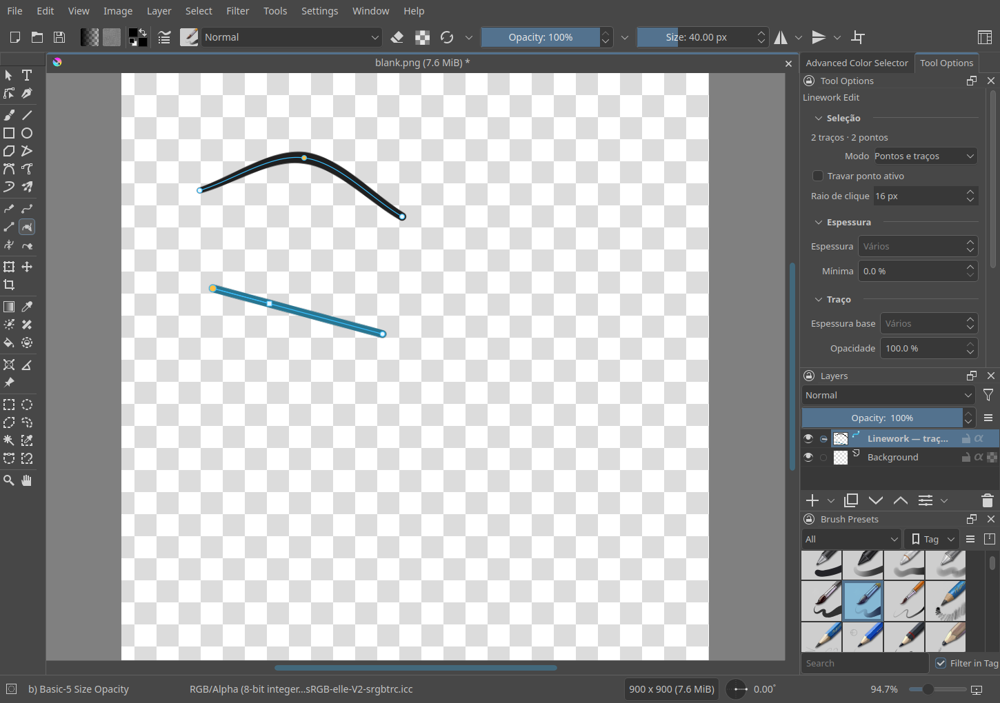

## Functional tests

**83 CPU tests passed** for the implementation included in 0.1.3 (70 in the previous 0.1.2 checkout). They cover the model, selection, insertion, serialization, fingerprints, affine transforms, compaction, vectorization, swept erasing, spatial indexing, shared history and point/endpoint topology. A differential test compiles the original OpenToonz sources and checks **exact equality of quadratic position and radius controls in 16 synthetic fixtures**.

| Operation in Krita | Verified behavior |
| --- | --- |
| Treated grayscale bitmap → Linework | New native layer, 743 strokes / 2,206 anchors, unchanged source pixels. |
| Preview zoom | Zoom and fit use cached data. |
| Change every stroke's brush | Pixel Art applied to all strokes; geometry preserved; undo/redo restores the operation. |
| Change every point's diameter | All points reach 4 px; original pressure and handles preserved; one undo step. |
| Edit an imported point | Stroke rerendered; undo/redo restores its data. |
| Save and reopen | Editable data match and the original raster bytes remain unchanged. |
| Another plugin querying shapes | Observer timer runs during preparation; no reads occur during protected scene mutation. |
| Group selection and editing | Select Shapes inheritance, Shift, rectangle, dragging, indicators, deletion and history. |
| Recolor existing strokes | Native brushes and smooth lines, selected/whole-layer scope, one undo step and preserved `.kra` data. Linux and Windows/Wine color probes passed. |
| Erase, merge and join | Native pixels, zero-width recovery, tablet strength, whole-line sweeps, history, cancellation, locked layers, active style and preserved diameters. |
| Point/stroke selection and locking | Enlarged point/handle targets, clicks from anchors selecting a whole path, pinned selection across Edit/Thickness and canceled dragging. |
| Brush and smoothing | Four native filters, pressure, handles, reduction, Esc, delay, tool switching and saving during drawing. |
| Release and continued drawing | Rapid mouse/tablet strokes in all four modes, input during native waits, queued undo/redo, missed release, rendered pixels and save/reopen. Linux and Windows/Wine probes passed. |

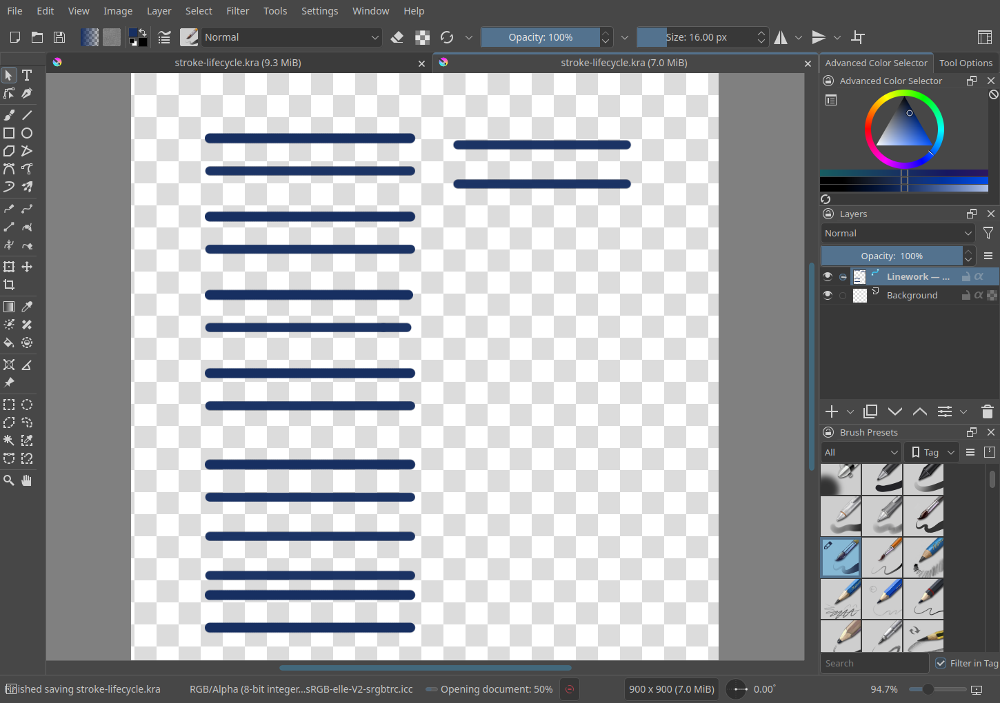

*Stroke lifecycle regression in the real Linux application, after reopening the `.kra`. The test deliberately delivers another gesture inside a native render boundary to reproduce nested Qt input delivery. The original implementation failed with a missing stroke ID and cleared the editor; the fix retains both gestures and allows subsequent drawing. This is a controlled Qt event regression, not physical tablet validation. [Before](docs/validation/stroke-lifecycle-before.json), [Linux](docs/validation/stroke-lifecycle.json), [Windows/Wine](docs/validation/windows-stroke-lifecycle.json).*

On the grayscale Pepper fixture, an earlier release run took **36.1 s** to change the whole layer's preset and **81.8 s** to set all diameters, including rendering and layer writes. The development stress run for 0.1.3 completed both operations, with a deliberately heavy shape observer, in **77.7 s** and **157.1 s** respectively, excluding subsequent history checks. These different runs do not establish a speed improvement for whole-layer rendering. Large layers and expensive presets can still take time; progress and cancellation are available during preparation.

An outer native busy wait protects shape mutations while Krita drains its workers. Nested waits cannot run timers that read shapes being replaced. The observer test reproduces that access pattern; it does not certify every version of every third-party plugin.

[Testing instructions](docs/TESTING.md), [JSON reports](docs/validation/) and runnable probes are included. Screenshots show the real application. Try the [prepared lineart](examples/pepper-lineart.png), [editable result](examples/pepper-linework.kra) and [smoothing example](examples/smoothing-and-points.kra).

## Windows build and validation

The **0.1.1 color regression passed** in the official Windows application under Wine 11.0: native brush and smooth-line recoloring, selected/whole-layer scope, rendered pixels, debounce, undo/redo, locked layers and save/reopen. [Color regression report](docs/validation/windows-color.json). The 0.1.2 eraser/topology and selection regression also passed, including all 21 checks and a normal application exit. [Regression report](docs/validation/windows-eraser-topology.json). Version 0.1.3 rebuilds the native rendering bridge for preset caching; its eraser/topology, stroke lifecycle, interface and paired cache probes passed under Wine. The native vectorizer is unchanged. [Current bridge hashes and regression scope](docs/validation/performance.json).

The Windows package contains native **PE x86-64 DLLs**, built with **LLVM-MinGW Clang 18.1.8 UCRT**, matching the official Krita 5.2.14 toolchain. It uses Krita's existing runtime libraries. [Build provenance and binary hashes](docs/validation/windows-build.json).

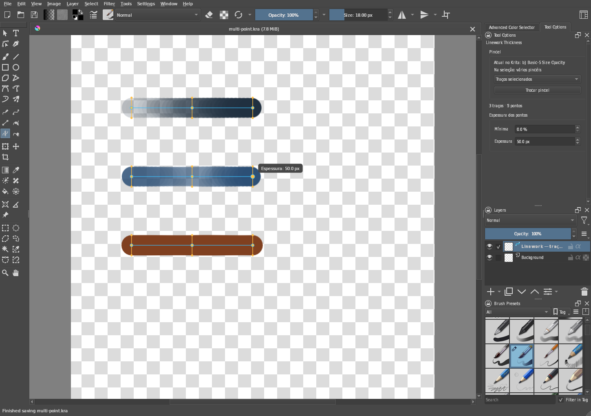

*The official Windows application under Wine 11.0, showing selected points, independent thickness, native Tool Options and the Linework layer icon. Synthetic artwork created for this project.*

The Windows application passed the same multiple-selection regression: inherited Select Shapes selection, grouped thickness, preserved pressure/handles, hidden original previews, Esc restoration, rectangle selection, deletion, history and save/reopen. [Windows report](docs/validation/windows-multi-point.json). The four native smoothing modes also passed: the test strokes reduced from 101/101/101/1,139 to 10/7/12/6 anchors, with pressure, cancellation, delay, saving during drawing and history checked. [Windows smoothing report](docs/validation/windows-smoothing.json). **Known Windows/Wine issue:** the complete 743-stroke bulk brush/thickness/history probe did not finish; diagnostic traces reached native scratch-image waits during brush redo. The cause and behavior on physical Windows are unconfirmed. The Windows download is an **experimental preview**; large-layer replay/history is not validated. [Validation status](docs/validation/windows-status.json). These are Wine-based regressions; a physical Windows tablet has not been tested.

## The same OpenToonz Centerline algorithm

This is a **reimplementation/port of the same OpenToonz Centerline vectorization algorithm inside Krita**, based directly on the original BSD-3-Clause code at revision [`8c5345182b1c3d2ff011a1cf08dad067b6700f08`](https://github.com/opentoonz/opentoonz/tree/8c5345182b1c3d2ff011a1cf08dad067b6700f08).

The port runs polygonization, straight-skeleton extraction, graph organization, stroke fitting and color routines. Quadratic position and radius controls are elevated exactly to cubics for Linework's model. Original files, hashes and integration patches are recorded in [ORIGIN.json](linework/native/opentoonz/ORIGIN.json) and [VECTORIZATION.txt](VECTORIZATION.txt).

The implemented path is Centerline for RGB/grayscale raster. Host adapters provide types and storage. TLV colormaps, NAA preparation and filled regions are outside this integration. Final rendering uses Linework/Krita, so tested core equality does not imply pixel-identical output to the complete OpenToonz application.

## Codex, Ghidra and reverse engineering

**OpenAI Codex was used to develop this plugin**, including analysis, implementation, integration and tests. **Ghidra 11.0.3 was used for static reverse engineering of Paint Tool SAI 2**, using a local executable supplied by the user.

The analysis records show completed PE x86-64 import, **7,038 functions** identified by automatic analysis, and an inventory of **59 strings** associated with the investigated features and their references. The project's [inspection script](docs/InspectLinework.java) walks defined strings and references to locate linework, curve and pressure features.

This evidence supports feature investigation and behavioral inspiration. It does not establish a copy of SAI's internal brush algorithm or file format. The implementation uses Krita's engine, Linework geometry and OpenToonz's open-source code. No SAI executable, Ghidra database, proprietary assets or decompiled SAI code are distributed.

## Limitations and licenses

Each stroke renders onto transparency; presets depending on pigment from other layers do not preserve that interaction. Physical stylus tilt, rotation and velocity are not recorded. Linework has its own session history. There is no `.sai2` import, curve cutting, arbitrary branching networks, wraparound canvas or OpenToonz filled-region reconstruction. Full document resizing does not update stored centerline metadata. Physical tablet compatibility needs validation on each device.

The integration is **GPL-3.0-or-later** ([LICENSE](LICENSE)). The OpenToonz core retains **BSD-3-Clause** notices ([THIRD-PARTY-NOTICES.txt](THIRD-PARTY-NOTICES.txt)). Pepper artwork and its derivatives are **CC BY 4.0**, credited to **David Revoy** with the changes described in [ARTWORK.md](docs/ARTWORK.md). This independent project does not imply endorsement by Krita, Paint Tool SAI, OpenToonz or the artwork's author.
